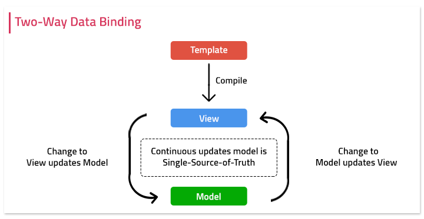

学习笔记

## 双向绑定



## 步骤

### 先完成单向绑定 (Modal -> View)
1. 只要更改Model，View就会更改。
2. 设置一个数组，把需要callback的函数储存在一起
3. 再从数组里面的函数一一的用Proxy执行

```html
<input id="input">
<script>
    let obj = {
        a: 3
    }
    let callbacks = []

    callbacks.push(() => {
        document.getElementById('input').value = obj.a;
    })

    let po = new Proxy(obj, {
        set(target, props, value) {
            for (const callback of callbacks) {
                callback(value);
            }
        }
    })
    po.a = 4;
</script>
```

### 然后(View -> Modal)
1. 只要更改View值，Modal也会变动

```html
<input id="input">
<div id="display">
<script>
    let obj = {
        a: 3
    }
    let callbacks = []
    callbacks.push(() => {
        document.getElementById('input').value = po.a;
    })
    callbacks.push(() => {
        document.getElementById('display').innerText = po.a;
    })

    let po = new Proxy(obj, {
        set(target, props, value) {
            target[props] = value;
            for (const callback of callbacks) {
                callback(value);
            }
        },
        get(target, props) {
            return target[props]
        }
    })
    document.getElementById("input").addEventListener("input", (e) => {
        po.a = e.target.value;
    });
</script>
```

### 优化

1. 只做监听需要的effect
2. 深度监听对象

### Range

1. insertNode 并不会拷贝新的node，还是会调用旧的node
2. document mousemove listener可以听浏览器以外的位置

### 注意

1. 必须先查找是否对象有没有key，要不然会有报错的风险。