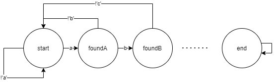

学习笔记

# 有限状态机 (Finite-state machine)

1. 特征 - 一个状态一个机器
   1. 用函数表示，都是纯函数 (No side effect)
   2. 每个机器接受的输入是一致
   3. 知道下一个状态
      1. 确定下一个状态 （Moore）
      2. 根据输入决定下一个状态 （Mealy)


## Example: Find abcdef



## ISO-OSI 

1. 7 层
2. 从上至下，
   1. 前三层可以列为http
   2. TCP
   3. Internet
   4. 4G/Wifi

## TCP

1. 流
2. 端口
3. node - require('net')
4. 做成包
5. 根据IP传输
6. 运用了C++的libnet/libpcap

## HTTP 请求

```
POST / HTTP1.1     <-- Request Line -->
Host: 127.0.0.1    <-- Headers -->
Content-Type: ...

field1=aaa&code=x  <-- Body -->
```

1. HTTP 换行通常都 `\r\n`

## HTTP Response
```
HTTP1.1 200 OK       <-- Status line -->
Content-Type:...     <-- Headers -->
Transfer-Encoding
                     <-- Blank -->
26                   <-- Body >
<html><body> Hello world</body></html>
0

```

1. Node 默认使用 chunked body
   1. base 16 数字单独占一行


## 注意情况
1. \`\`  任何空号都会被记录


