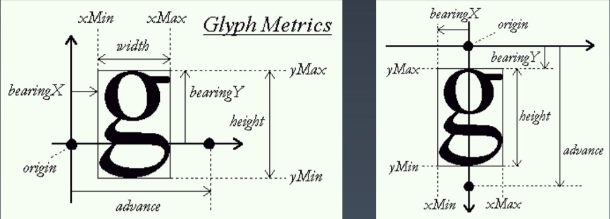
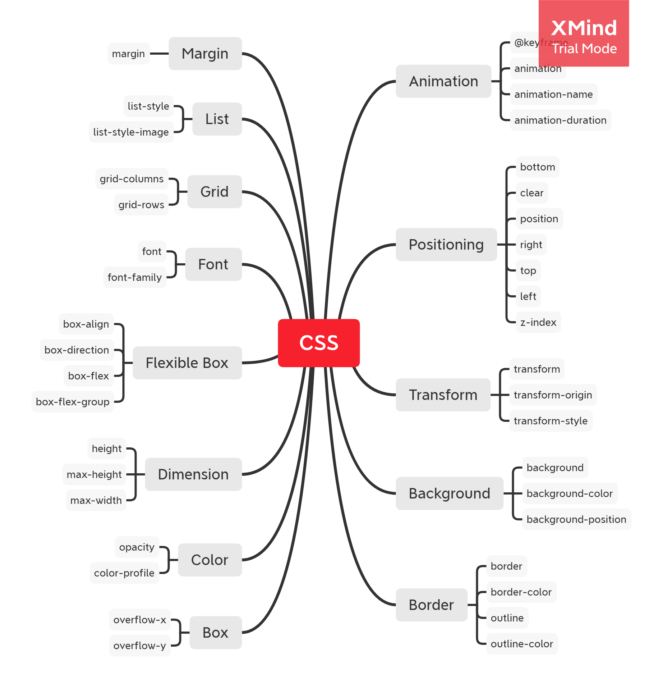

学习笔记

## 盒

1. 标签 - 源代码的概念
2. 元素 - 语义的概念

### 注意

1. 元素是其中一个节点，有很多不同类型的节点
2. Box sizing
   1. content-box: width = content
   2. box-sizing: width = content + padding + border

## 正常流

1. 三代
   1. 正常流
   2. flex
   3. grid

2. 像以前的印刷工厂，文字和盒有一个对齐规则
3. 两种
   1. Inline-formatting context (IFC)
      1. line-box
      2. block-level-box
   2. Block-formatting context (BFC)
      1. inline-box
      2. text

### 正常流排版

1. 收集盒进行
2. 计算盒在行中的排布
3. 计算行的排布

## 正常流的行级排布

1. 一行字里通常会有一个baseline，每个字体（比如英文vs华语）都会有baseline
2. 这是通过Glyph metrics，来做计算

## 如何计算

1. 从这图我们可以分成多个部分
   1. line-box 有两条，
      1. top-line （上面)
      2. bottom-line (下面)
   2. content-area
      1. text-top
      2. text-bottom
   3. 还有一条baseline （不再图里）
2. 所以我们可以通过 `vertical-align` 来调整字体的位置

## BFC 

1. float 来调整行和的位置
   1. 比如`float:left;`,就会尝试在左边腾出位置装入盒
2. float会受上一个float影响
3. clear 是找没有浮动的位置
4. margin collapse （只有BFC有）
   1. 选最大的margin

## BFC合并

1. Block container: 里面有BFC的
2. Block-level container：外面有BFC的
3. Block-box：Block container + Block-level box，里外都有BFC的

### Block container

1. block
2. flex-item
3. inline-block
4. table-cell
5. grid cell
6. table-caption

### Block level

都是改display
1. block
2. flex
3. grid
4. table

什么时候会创建BFC
1. float
2. absolute position
3. 除overflow:visible 之外
4. block container that are not block box

或是简单的想，什么时候需要合并

如果是Block box 或者是 overflow:visible
1. BFC合并与float
2. BFC合并与边距折叠

### 创造BFC 的情况

1. 创造bfc的话
   1. 整个block box 就会放进bfc里
   2. block box的宽度就会受bfc影响
2. 不创造bfc,就会受float影响
3. margin collapse只会发生在同一个bfc里

### 注意情况

1. 如果在parent element set `overflow:hidden`， 那么parent 其实是与sibling在同一个BFC 的，而parent里则创建了一个新的BFC，所以children才会分开来

## Flex

1. 收集盒进行
2. 计算盒在主轴方向的排布
3. 计算盒在交叉轴方向的排布

### 简单概念
1. 如果超出，就移到下一行
2. 如果还有空位，计算flex-grow
3. 如果空位负数，就计算flex-shrink
4. 考虑两个 axis
   1. main
   2. cross

## 动画

1. @keyframes定义
2. animation

https://www.w3schools.com/css/css3_animations.asp

## 颜色

### CMYK vs RGB

1. 印刷使用CMYK
   1. 为啥有K，因为CMY混合的黑色很贵

### HSL vs HSV
1. 一个 L （Lightness）， 一个 V (Value)
   1. L越高，越白
   2. V越高，越纯
2. WS3使用HSL

### HSL什么时候优势

1. 为什么HSL有一定的作用（比起RGB）不会影响到亮度，或者是saturation，所以使用js操作，不需要顾虑到纯度。

## 绘制

1. 几何图形
   1. border
   2. box-shadow
   3. border-radius
2. 文字
   1. font
   2. text-decoration
3. 位图
   1. background-image

用svg直接干

