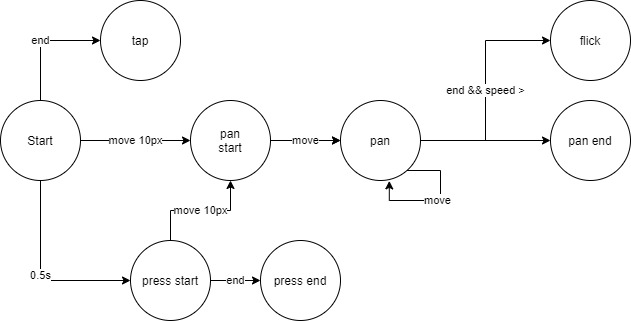

学习笔记

3 种

1. setInterval
2. setTimeout
3. requestAnimationFrame(tick)


```javascript
// Recommended
let tick = () => {
  setTimeout(tick, 16)
}

let tick = () => {
  requestAnimationFrame(tick)
}
```

Timeline

```javascript
class Timeline {
  constructor() {
    /*
      [[animations]], 
      [[startTime]]
      state
    */

  }
  start() {
    /*
    if state !== "inited":
    	return
    state = "started"
    
    Initialize startTime
    let tick = () => {
    	for animation in animations:
      	if startTime[animation] < startTime:
        	time elapsed t = now - startTime
        else:
        	t = now - startTime[animation]
        
        t -= [[pauseTime]] 
        t -= animation.delay
      	if t > duration:
        	Pass duration to animation
        	Remove animation
        else:
      		Pass time elapsed to animation
      Rerun tick by using requestAnimationFrame(tick);
    }
    tick();
    */
  }
  pause() {
    /*
    	if state !== "started":
    		return
    	state = "paused"
    	Record pause start
    	cancelAnimationFrame(tick);
    */
  }
  resume() {
    /*
    [[pauseTime]] += now() - [[pauseStart]]
    tick();
    */
  }
  reset() {
    // Reinitialize [[pauseTime]], [[pauseStart]], [[animations]], [[startTime]], [[tick]]
  }
  add(animation, addTime = now) {
    /*
    	Add aniamtion to [[animation]]
      Add {animation: addTime} to [[startTime]]
    */
  }
}
```

Animation

```javascript
class Animation {
  constructor(obj, prop, startValue, endValue, duration, delay, timingFunction, template) {}
  
  receiveTime(time) {
   	/*
    	Given time elapsed, calculate state
      progress = timingFunction(time / duration);
    	state = template(startValue + (endValue - startValue) * progress)
      
      Assign state to the obj
    */
  }
}
```

## Gesture

1. Mouse 不支持 touch 系列


